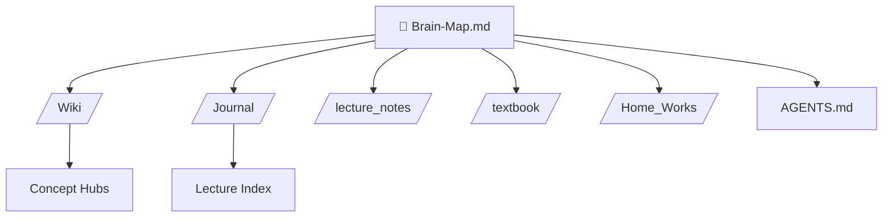

# 🧠 TSM I Second Brain — Master Map

> [!abstract] Mission
> This vault is a **Living AI Second Brain** for the **Thermodynamics & Statistical Mechanics I (TSM I)** course. It interconnects all lecture notes, textbook chapters, homeworks, and concept synthesis notes into a navigable knowledge graph.
> 
> Open this in **Obsidian** and switch to **Graph View** to see the network.

---

## 🗺️ Course Architecture (Big Picture)

The course covers major topics in Thermodynamics and Statistical Mechanics.

- **[[Thermodynamics]]** — Laws of thermodynamics, entropy, engines, potentials
- **[[Statistical Mechanics]]** — Microstates, macrostates, ensembles (microcanonical, canonical, grand canonical)
- **[[Applications]]** — Ideal gas, paramagnetism, phase transitions

---

## 📂 Vault Structure

---

## 🔑 Core Concept Hubs

- [[Laws of Thermodynamics]]
- [[Statistical Ensembles]]
- [[Partition Function]]

---

## 📅 Lecture Timeline

> [!tip] Navigation
> See [[Lecture Index]] for the full chronological list.

---

## 📚 Textbook Reference

- [[ترمودینامیک زیمانسکی]]
- [[دوره برکلی جلد پنجم آماری رایف]]
- [[فیزیک گرما مورس]]
- [[Concepts in Thermal Physics (Blundell)]]

---

## 📝 Home Works

- [[HW1]]
- [[HW2]]
- [[HW3]]
- [[HW4]]

---

## ⚠️ Quality Control

- [[AGENTS]] — The AI agent's rulebook

---

*Last updated: {{date}}*
